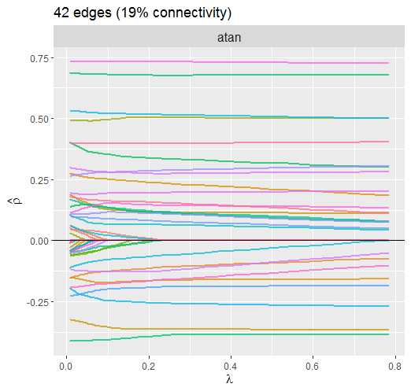
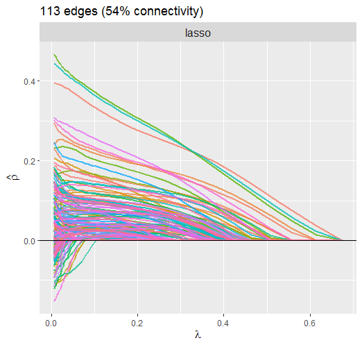

<!-- README.md is generated from README.Rmd. Please edit that file -->

```{r, include = FALSE}
knitr::opts_chunk$set(
  collapse = TRUE,
  comment = "#>",
  fig.path = "man/figures/README-",
  out.width = "100%"
)
```


# GGMncv: Gaussian Graphical Models with Non-Convex Penalties

[](https://cran.r-project.org/package=GGMncv)
[](https://cran.r-project.org/package=GGMncv)
[](https://travis-ci.org/donaldRwilliams/GGMncv)

The goal of GGMncv is to provide non-convex penalties for estimating Gaussian graphical models. These are known to overcome the various limitations of lasso (least absolute shrinkage "screening" operator), including inconsistent model selection [@zhao2006model], biased estimates [@zhang2010nearly]<span id="a1">[[1]](#f1)</span>, and a high false positive rate [see for example @williams2020back; @williams2019nonregularized].

Note that these limitations of lasso are well-known. In the case of false positives, for example, it has been noted that 

>The lasso is doing variable screening and, hence, I suggest that we interpret
> the second ‘s’ in lasso as ‘screening’ rather than ‘selection’. 
> Once we have the screening property, the task is to remove the false 
positive selections [p. 278, @tibshirani2011regression].


There are various ways to remove the false positives, including thresholding after model selection 
[i.e., removing small relations, @loh2012structure] and two-step procedures
lasso [@zou2006adaptive]. The approach in **GGMncv**, on the other hand, 
selects the graph with non-convex penalization (with *L*<sub>1</sub> as a special case).

An example of how these penalties address the bias of *L*<sub>1</sub> regularization is provided in [Solution Path](#solution-path).

Important caveats relating to statistical inference are provided [below](#a-note-on-statistical-inference).

## Installation

You can install the released version of GGMncv from
[CRAN](https://CRAN.R-project.org) with:

``` r
install.packages("GGMncv")
```

You can install development version from [GitHub](https://github.com/) with:
``` r
# install.packages("devtools")
devtools::install_github("donaldRwilliams/GGMncv")
```

## Penalties

The following are implemented in `GGMncv`:

1. Atan [`penalty = "atan"`; @wang2016variable]. This is currently the default.

2. Seamless *L*<sub>0</sub>  [`penalty = "selo"`; @dicker2013variable]

3. Exponential [`penalty = "exp"`; @wang2018variable]

4. Smooth integration of counting and absolute deviation [`penalty = "sica"`; @lv2009unified]

5. Log [`penalty = "log"`; @mazumder2011sparsenet]

6. *L*<sub>q</sub> [`penalty = "lq"`, *0* < *q* < *1*; e.g., @knight2000asymptotics]

7. Smoothly clipped absolute deviation [`penalty = "scad"`; @fan2001variable]

8. Minimax concave penalty [`penalty = "mcp"`; @zhang2010nearly]

9. Adaptive lasso [`penalty = "adapt"`; @zou2006adaptive]

10. Lasso [`penalty = "lasso"`; @tibshirani1996regression]


Options 1-5 are continuous approximations to the *L*<sub>0</sub> penalty, that is, best subsets 
model selection. However, the solution is computationally efficient and solved with the local 
linear approximation described in @fan2009network or the one-step approach described in @zou2008one. 

Note that computing the non-convex solution is a challenging task. However, section 3.3 in @zou2008one 
indicates that the one-step approach is a viable **approximation** for a variety of non-convex penalties, assuming the initial estimates are "good enough"<span id="a2">[[2]](#f2)</span>. 

## Tuning Parameter
### Tuning Free


The default approach in **GGMncv** is tuning free. This is accomplished by setting the tuning parameter to `sqrt(log(p)/n)` [see for example @zhang2018silggm; @li2015flare; @jankova2015confidence]. $\sqrt{log(p)/n}$ 


### Selection
It is also possible to select the tuning parameter with several information criterion (IC), 
including `aic`, `bic`,`ebic`, `ric`, in addition to any of the *generalized* information criteria 
provided in section 5 of @kim2012consistent. There are 6 GICs in total that are specified as  `gic_1` to `gic_6`. Note that `gic_1` is BIC, whereas `gic_3` is RIC. Lambda is selected by setting `select = TRUE` and 
then the desired IC with, for example, `ic = "gic_3"`.


## Example: Structure Learning
A GGM can be fitted as follows

```r
library(GGMncv)

# data
Y <- GGMncv::ptsd[,1:10]

# polychoric
S <- psych::polychoric(Y)$rho

# fit model
fit <- GGMncv(S, n = nrow(Y), 
              penalty = "atan", 
              LLA = TRUE)

# print
fit

#>       1     2     3     4     5     6     7     8     9    10
#> 1  0.000 0.255 0.000 0.309 0.101 0.000 0.000 0.000 0.073 0.000
#> 2  0.255 0.000 0.485 0.000 0.000 0.000 0.122 0.000 0.000 0.000
#> 3  0.000 0.485 0.000 0.185 0.232 0.000 0.000 0.000 0.000 0.000
#> 4  0.309 0.000 0.185 0.000 0.300 0.000 0.097 0.000 0.000 0.243
#> 5  0.101 0.000 0.232 0.300 0.000 0.211 0.166 0.000 0.000 0.000
#> 6  0.000 0.000 0.000 0.000 0.211 0.000 0.234 0.079 0.000 0.000
#> 7  0.000 0.122 0.000 0.097 0.166 0.234 0.000 0.000 0.000 0.000
#> 8  0.000 0.000 0.000 0.000 0.000 0.079 0.000 0.000 0.000 0.114
#> 9  0.073 0.000 0.000 0.000 0.000 0.000 0.000 0.000 0.000 0.261
#> 10 0.000 0.000 0.000 0.243 0.000 0.000 0.000 0.114 0.261 0.000
```

Note that the object `fit` can be plotted with the `R` package [**qgraph**](https://cran.r-project.org/web/packages/qgraph/qgraph.pdf). 

## Example: Out-of-Sample Prediction
The **GGMncv** package can also be used for prediction, given the correspondence 
between the inverse covariance matrix and multiple regression [@kwan2014regression]. 

```r
# protein expression data
Y <- scale(Sachs)

# test data
Ytest <- Y[1:100,]

# training data
Ytrain <- Y[101:nrow(Y),]

# default: atan and tuning free
fit <- GGMncv(Ytrain, 
              n = nrow(Ytrain))

# predict
pred <- predict(fit, newdata = Ytest)

# print mse
round(apply((pred - Ytest)^2, 2, mean), 2)

#> Raf  Erk Plcg  PKC  PKA PIP2 PIP3  Mek  P38  Jnk  Akt 
#> 0.16 0.27 0.60 0.42 0.40 0.47 0.70 0.15 0.14 0.69 0.26 
```

## Solution Path
When `select = TRUE`, the solution path for either the partial correlations (`code = "pcor_path"`) or the information criterion (`code = "ic_path"`) can be plotted.

### Atan Penalty
Here is the current default penalty

```r
# data
Y <- ptsd

# fit model
fit <- GGMncv(cor(Y), n = nrow(Y), 
              select = TRUE, 
              store = TRUE)
              
# plot path
plot(fit, 
     alpha = 0.75, 
     type = "pcor_path") 
```


The dotted line is denotes the selected lambda. Notice how the larger partial correlations "escape" regularization, at least to some degree, compared to the 
smaller partial correlations. 

### Lasso Penalty
Next *L*<sub>1</sub> regularization is implemented by setting `penalty = "lasso"`.

```r
# data
Y <- ptsd

# fit model
fit <- GGMncv(cor(Y), n = nrow(Y), 
              select = TRUE, 
              penalty = "lasso"
              store = TRUE)

# plot path
plot(fit, 
     alpha = 0.75, 
     type = "pcor_path") 
```



This solution is much different than above. For example, it is clear that the large partial correlations
are heavily penalized, whereas this was not so for the atan penalty. The reason this is not ideal is that,
if the partial correlations are large, it makes sense that they should not be penalized that much. This
property of non-convex regularization should provide *nearly* unbiased estimates, which can improve, say,
predictive accuracy.

Also notice that the atan penalty provides a sparser solution.


## Bootstrapping
**GGMncv** does not provide confidence intervals.  This is because, in general, 
"confidence" intervals from penalized approaches do not have the correct properties to 
be considered confidence intervals 
[(see Wikipedia)](https://en.wikipedia.org/wiki/Confidence_interval). This 
sentiment is echoed in Section 3.1, "Why standard bootstrapping and subsampling do not work," of 
@Buhlmann2014:

> The (limiting) distribution of such a sparse estimator is non-Gaussian with 
> point mass at zero, and this is the reason why standard bootstrap or subsampling 
> techniques do not provide valid confidence regions or p-values (pp. 7-8).


For this reason, it is common to **not** provide standard errors (and thus confidence intervals) for penalized models <span id="a3">[[3]](#f3)</span>. **GGMncv** follows the idea of behind the **penalized** `R` package:


>It is a very natural question to ask for standard errors of regression coefficients
>or other estimated quantities. In principle such standard errors can easily be
>calculated, e.g. using the bootstrap. Still, this package deliberately does not provide them. The reason for this is that standard errors are not very meaningful for strongly biased estimates
such as arise from penalized estimation methods [p.18, @goeman2018l1]

However, **GGMncv**  does include the so-called variable inclusion "probability" for each relation [see p. 1523 in @bunea2011penalized; 
and Figure 6.7 in @hastie2015statistical]. These are computed using a non-parametric bootstrap strategy.

### Variable Inclusion "Probability"

```r
# data
Y <- GGMncv::ptsd[,1:10]

# polychoric
S <- psych::polychoric(Y)$rho

# fit model
fit <- GGMncv(S, n = nrow(Y), 
              penalty = "atan", 
              vip = TRUE)

# plot
plot(fit, size = 4, type = "vip")
```


## A Note on Statistical Inference
It might be tempting to think these approaches lead to rich *inference*. 
This would be a mistake--they suffer from all of the problems inherent to
automated procedures for model selection [e.g., @berk2013valid; @lee2016exact]. 

And note that:

1. Simply **not** detecting an effect does not provide evidence for the null hypothesis.

2. There is **not** necessarily a difference between an effect that was and an effect 
that was not detected. 

Supporting these claims would require a valid confidence interval that has been corrected 
for model selection and/or regularization. With these caveats in mind, **GGMncv** can 
be used for explicit data mining or prediction.

## Citing **GGMncv**
It is important to note that **GGMncv** merely provides a software implementation of other researchers 
work. There are no methological innovations, although this is the most comprehensive `R` package
for estimating GGMs with non-convex penalties. Hence, in addition to citing the package 
`citation("GGMncv")`, it is important to give credit to the primary sources. The 
references can be found in [(Penalties)](#penalties).


## Footnotes
1. <span id="f1"></span> Note that the penalties in **GGMncv** should provide *nearly* unbiased estimates [(return)](#a1).

2. <span id="f2"></span>  In low-dimensional settings, assuming that *n* is sufficiently larger than *p*,
the sample covariance matrix provides adequate initial estimates. In high-dimensional settings (*n* < *p*), the initial estimates are obtained from lasso [(return)](#a2). 

3. <span id="f3"></span>  It is possible to compute confidence intervals for lasso with the methods included in the **SILGGM** `R` package  [@zhang2018silggm]. These do not use the bootstrap [(return)](#a3).

## References
