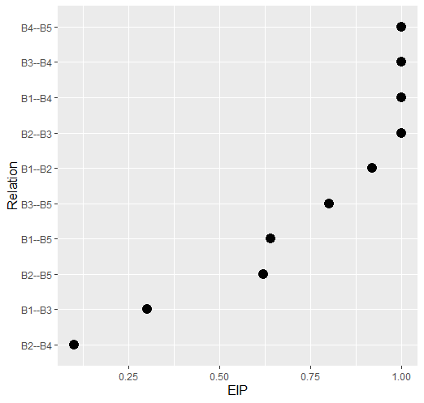

<!-- README.md is generated from README.Rmd. Please edit that file -->

```{r, include = FALSE}
knitr::opts_chunk$set(
  collapse = TRUE,
  comment = "#>",
  fig.path = "man/figures/README-",
  out.width = "100%"
)
```


# GGMncv: Gaussian Graphical Models with Non-Convex Penalties

[](https://travis-ci.org/donaldRwilliams/GGMncv)

The goal of GGMncv is to provide non-convex penalties for estimating Gaussian graphical models. These are known to overcome the various limitations of lasso, including (but not limited to) inconsistent model selection [@zhao2006model], biased  <span id="a1">[[1]](#f1)</span>

 estimates [@zhang2010nearly], and a high false positive rate [see for example @williams2020back; @williams2019nonregularized].

Note that these limitations of lasso are well-known. In the case of false positives, for example, it has been noted that 

>The lasso is doing variable screening and, hence, I suggest that we interpret
> the second ‘s’ in lasso as ‘screening’ rather than ‘selection’. 
> Once we have the screening property, the task is to remove the false 
positive selections [p. 278, @tibshirani2011regression].

Hence, contrary to the popular view of lasso (least absolute shrinkage "screening" operator), 
using it for model *selection* is not ideal. There are various ways to remove the false positives, including thresholding after model selection [i.e., removing small relations, @loh2012structure] 
and two-stage procedures [@zou2006adaptive]. The approach in **GGMncv**, on the other hand, selects
the graph with non-convex penalization (with lasso as a special case).


## Installation

You can install the development version from [GitHub](https://github.com/) with:

<!-- released version of GGMncv from -->
<!-- [CRAN](https://CRAN.R-project.org) with: -->

<!-- ``` r -->
<!-- install.packages("GGMncv") -->
<!-- ``` -->

``` r
# install.packages("devtools")
devtools::install_github("donaldRwilliams/GGMncv")
```


## Penalties
The following are implemented in `GGMncv`:

1. Atan [`penalty = "atan"`; @wang2016variable]. This is currently the default.

2. Seamless L0  [`penalty = "selo"`; @dicker2013variable]

3. Exponential [`penalty = "exp"`; @wang2018variable]

4. Log [`penalty = "log"`; @mazumder2011sparsenet]

4. Smoothly clipped absolute deviation [`penalty = scad`; @fan2001variable]

5. Minimax concave penalty [`penalty = mcp`; @zhang2010nearly]

Note that options 1-3 are explicit, continuous approximations, to the L0 penalty, that is, best subsets model selection. However, the solution is computationally efficient and solved with the local linear approximation described in @fan2009network or the one-step approach described in @zou2008one.

## Tuning Parameter
### Tuning Free

The default approach in **GGMncv** is tuning free. This is accomplished by setting the tuning parameter to `sqrt(log(p)/n)` [see for example @zhang2018silggm; @li2015flare; @jankova2015confidence].

### Selection
It is also possible to select the tuning parameter with BIC. This is accomplished by setting `select = TRUE`.


## Example
A GGM can be fitted as follows

```r
library(GGMncv)

# data
Y <- GGMncv::ptsd[,1:10]

# polychoric
S <- psych::polychoric(Y)$rho

# fit model
fit <- GGMncv(S, n = nrow(Y), 
              penalty = "atan", 
              LLA = TRUE)

# print
fit

#>       1     2     3     4     5     6     7     8     9    10
#> 1  0.000 0.255 0.000 0.309 0.101 0.000 0.000 0.000 0.073 0.000
#> 2  0.255 0.000 0.485 0.000 0.000 0.000 0.122 0.000 0.000 0.000
#> 3  0.000 0.485 0.000 0.185 0.232 0.000 0.000 0.000 0.000 0.000
#> 4  0.309 0.000 0.185 0.000 0.300 0.000 0.097 0.000 0.000 0.243
#> 5  0.101 0.000 0.232 0.300 0.000 0.211 0.166 0.000 0.000 0.000
#> 6  0.000 0.000 0.000 0.000 0.211 0.000 0.234 0.079 0.000 0.000
#> 7  0.000 0.122 0.000 0.097 0.166 0.234 0.000 0.000 0.000 0.000
#> 8  0.000 0.000 0.000 0.000 0.000 0.079 0.000 0.000 0.000 0.114
#> 9  0.073 0.000 0.000 0.000 0.000 0.000 0.000 0.000 0.000 0.261
#> 10 0.000 0.000 0.000 0.243 0.000 0.000 0.000 0.114 0.261 0.000
```


## Bootstrapping
It might be tempting to perform a bootstrap and then attempt to construct confidence intervals for the edges. However, in general, these "confidence" intervals do not have the correct properties to be considered confidence intervals (see  [Wikipedia](https://en.wikipedia.org/wiki/Confidence_interval)). This 
sentiment is echoed in Section 3.1, "Why standard bootstrapping and subsampling do not work As," of 
@Buhlmann2014:

> The (limiting) distribution of such a sparse estimator is non-Gaussian with 
> point mass at zero, and this is the reason why standard bootstrap or subsampling 
> techniques do not provide valid confidence regions or p-values (pp. 7-8).


For this reason, it is common to not provide standard errors (and thus confidence intervals) for 
penalized models. **GGMncv** follows the idea of behind the **penalized** `R` package:


>It is a very natural question to ask for standard errors of regression coefficients
>or other estimated quantities. In principle such standard errors can easily be
>calculated, e.g. using the bootstrap. Still, this package deliberately does not provide them. The reason for this is that standard errors are not very meaningful for strongly biased estimates
such as arise from penalized estimation methods [p.18, @goeman2018l1]

Thus, at this time, confidence intervals are not provided for the partial correlations
^[It is possible to compute confidence intervals for lasso with the methods included in the **SILGGM** `R` package. These do not use the bootstrap [@zhang2018silggm]]. However, **GGMncv**  does include the so-called variable inclusion "probability" for each relation [see p. 1523 in @bunea2011penalized; 
and Figure 6.7 in @hastie2015statistical]. These are computed using a non-parametric bootstrap strategy.

### Variable Inclusion "Probability"

```r
# data
Y <- GGMncv::ptsd[,1:10]

# polychoric
S <- psych::polychoric(Y)$rho

# fit model
fit <- GGMncv(S, n = nrow(Y), 
              penalty = "atan", 
              vip = TRUE)

# plot
plot(fit, size = 4)
```


## Footnotes
1. <span id="f1"></span> Note that the penalties in **GGMncv** should provide *nearly* unbiased estimates. [return](#a1)


## References
