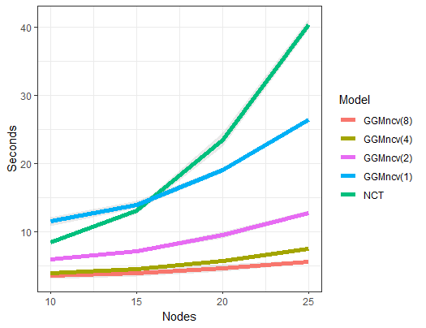

```{r, include = FALSE}
knitr::opts_chunk$set(
  collapse = TRUE,
  comment = "#>"
)
```


# Introduction

It is important to note that `nct` is based on the `NCT` function
in the `R` package **NetworkComparisonTest**. Key extensions
to the methodology are nonconvex regularization, the de-sparsified 
glasso estimator, additional default tests (e.g., KL-divergence), and 
user-defined test-statistics, to name but a few. 

Furthermore, `nct` should be much faster for two primary reasons:

1. **glassoFast**, introduced in [@sustik2012glassofast], is used 
instead of **glasso**. 

2. Parallel computing via **parallel**'s `parLapply`, whereas 
**NetworkComparisonTest** uses a serially executed for loop
(with `cores = 1`, **GGMncv** uses `lapply`)

The gains in speed will be most notable in larger networks, as
shown in the following comparison.

# CPU Time

In the following, time, as a function of network size, is 
investigated for several `cores` compared to `NCT`. Note that 
all settings in **GGMncv** are set to be comparable to `NCT`, 
for example, using `lasso` and the number of tuning parameters 
(i.e., `50`). One important distinction is that **GGMncv**
compute 4 default test-statistic instead of 2 
(as in `NCT`).


```r
library(GGMncv)
library(dplyr)
library(ggplot2)
library(NetworkComparisonTest)

p <- seq(10, 25, 5)

sim_fun <- function(x){
  
  main <- gen_net(p = x, edge_prob = 0.1)
  
  y1 <- MASS::mvrnorm(n = 500, 
                      mu = rep(0, x), 
                      Sigma = main$cors)
  
  y2 <- MASS::mvrnorm(n = 500, 
                      mu = rep(0, x), 
                      Sigma = main$cors)
  
  
  st_1 <- system.time({
    fit_1 <- nct(Y_g1 = y1, 
                 Y_g2 = y2, 
                 iter = 1000, 
                 desparsify = FALSE, 
                 penalty = "lasso", 
                 cores = 1, 
                 progress = FALSE)
  })
  
  st_2 <- system.time({
    fit_1 <- nct(Y_g1 = y1, 
                 Y_g2 = y2, 
                 iter = 1000, 
                 desparsify = FALSE, 
                 penalty = "lasso", 
                 cores = 2, 
                 progress = FALSE)
  })
  
  st_4 <- system.time({
    fit_1 <- nct(Y_g1 = y1, 
                 Y_g2 = y2, 
                 iter = 1000, 
                 desparsify = FALSE, 
                 penalty = "lasso", 
                 cores = 4, 
                 progress = FALSE)
  })
  
  
  st_8 <- system.time({
    fit_1 <- nct(Y_g1 = y1, 
                 Y_g2 = y2, 
                 iter = 1000, 
                 desparsify = FALSE, 
                 penalty = "lasso", 
                 cores = 8, 
                 progress = FALSE)
  })
  
  
  
  st_NCT <- system.time({
    
    fit_NCT <- NCT(data1 = y1, 
                 data2 = y2, 
                 it = 1000, 
                 progressbar = FALSE)
  })
  
  
  ret <- data.frame(
    times =  c(st_1[3], st_2[3], 
               st_4[3], st_8[3], st_NCT[3]),
    models = c("one", "two", 
               "four", "eight", "NCT"),
    nodes = x
  )
  
  return(ret)

}


sim_res <- list()

reps <- 5

for(i in seq_along(p)){
  print(paste("nodes", p[i]))
  
  sim_res[[i]] <- do.call(rbind.data.frame, 
                          replicate(reps, sim_fun(p[i]), 
                                    simplify = FALSE))
}


do.call(rbind.data.frame, sim_res) %>%
  group_by(models, nodes) %>%
  summarise(mu = mean(times), 
            std = sd(times)) %>%
  ggplot(aes(x = nodes, y = mu, group = models)) +
  theme_bw() +
  geom_ribbon(aes(ymax = mu + std, ymin = mu - std), 
              alpha = 0.1) +
  geom_line(aes(color = models), size = 2) +
  ylab("Seconds") +
  xlab("Nodes") +
  scale_color_discrete(name = "Model", 
                       labels = c("GGMncv(8)",
                                  "GGMncv(4)",
                                  "GGMncv(2)",
                                  "GGMncv(1)", 
                                   "NCT"), 
                       breaks = c("eight", 
                                  "four", 
                                  "two", 
                                  "one", 
                                  "NCT"))

```



The performance gains are clear, 
especially when using 8 cores with **GGMncv**.

# References

